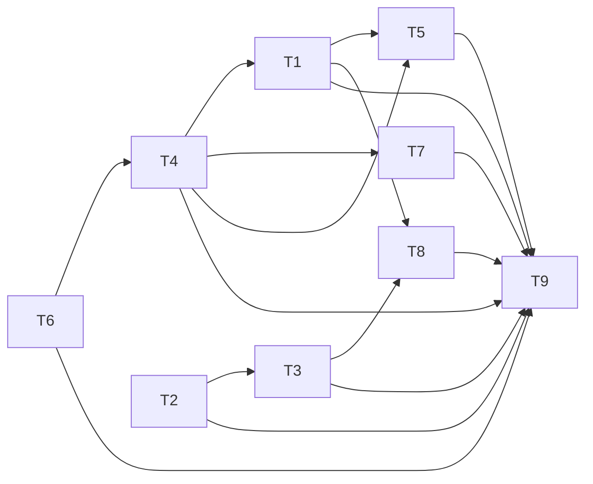

# Kế hoạch hardening trước phát hành — InLove

**Trạng thái:** kế hoạch triển khai; lượt này không thay đổi mã nguồn.  
**Phạm vi:** repo `D:\DMHoang\Project_GitHub\DemNgayYeuAndroid`; tích hợp app Android với `appplugin` 2.3.0, bảo vệ entitlement, cấu hình phát hành, giao diện và Play policy.  
**Nguyên tắc:** giữ kiến trúc Compose/MVVM hiện có; thay đổi nhỏ, có thể đảo ngược; không bật opt-in hoặc phát hành trước khi có bằng chứng và chủ sở hữu cấu hình xong dịch vụ ngoài repo.

## Cách dùng và cổng kiểm soát

Thực hiện theo thứ tự toàn cục bên dưới. Mỗi T là một gói thay đổi có thể review riêng. Không đánh dấu hoàn tất chỉ dựa trên build: reviewer đối chiếu diff, lệnh xác minh, tiêu chí chấp nhận và checklist của chính task. Phiên bản đích trong T4 là **cần xác minh** tại ngày triển khai; không suy ra “latest stable” từ phiên bản đang pin.

### Đường cơ sở đã đọc

- `AGENTS.md` yêu cầu Compose/Material 3, touch target tối thiểu 48dp, minSdk 24 và phân tách lớp dữ liệu.
- `app/build.gradle.kts` đang đặt minSdk 26, compileSdk/targetSdk 36, bật R8 cho release, dùng `.env` cho cấu hình Cloudinary và lấy signing release từ biến môi trường.
- `gradle/libs.versions.toml` hiện pin Compose BOM 2024.09.00, OkHttp 4.10.0, Lifecycle 2.8.7, Activity Compose 1.10.1, Room 2.7.0, Navigation Compose 2.8.9, Billing 8.1.0, UMP 3.1.0 và Google Mobile Ads 25.4.0. Đây là baseline, không phải khẳng định phiên bản mới nhất.
- `appplugin/CHANGELOG.md` và `appplugin/DOC/47_SDK_INTEGRATION.md` xác nhận nested repo ở 2.3.0. Tài liệu SDK yêu cầu AGP tối thiểu 9.2.1; catalog hiện dùng AGP 9.1.1. SDK có preload mặc định sau consent; policy brain/Play Integrity mặc định tắt và cần metadata/cấu hình/phê duyệt mới được opt-in.
- `firestore.rules` hiện cho owner tạo/cập nhật/xóa toàn bộ `users/{userId}`. `scripts/package.json` đã có lệnh `test:rules`; test pairing nằm trong `scripts/rules-tests`.
- `EntitlementRepository` hiện nạp trạng thái VIP từ SharedPreferences rồi nhận luồng billing trên thiết bị. `BillingManager` gọi entitlement của appplugin. `InLoveApplication` để brain tắt và dùng `VipProductIds` làm nguồn product ID.
- `app/src/main/AndroidManifest.xml` đã khai báo `SCHEDULE_EXACT_ALARM`. `SettingsScreen` có mục tùy chọn riêng tư và luồng xóa tài khoản; vẫn phải xác minh xóa dữ liệu hoàn tất và có yêu cầu xóa ngoài app.
- `.gitignore` đã có quy tắc cho `.env` và `debug.keystore`; `app/google-services.json` đang được Git theo dõi. `CloudinaryStorageService` và `CloudinaryMediaService` upload bằng unsigned preset. SMTP client nằm trong `RealSmtpEmailSender`/`EmailQueueService`.
- Các màn hình T7 dùng theme hiện có trong `DESIGN.md` và `app/src/main/java/com/example/ui/theme/`; repo đã có cấu hình Roborazzi và test screenshot mẫu.

## Thứ tự toàn cục

1. **T6 — Secrets/config và minSdk:** chốt minSdk, rà soát file bí mật và bề mặt SMTP/Cloudinary.
2. **T4 — Dependency/toolchain:** cập nhật AGP/Gradle tương thích appplugin 2.3.0, rồi nâng thư viện từ version catalog.
3. **T1 — Tích hợp appplugin:** sửa điểm tích hợp theo API 2.3.0, tránh hai bên cùng preload quảng cáo và chạy test app/SDK.
4. **T2 — Firestore rules:** chặn quyền tự ghi VIP/role/tier/entitlement và thêm emulator regression tests.
5. **T3 — Entitlement server-side:** chỉ server xác minh Google Play và ghi tài liệu entitlement mà client chỉ đọc.
6. **T5 — R8/ProGuard:** thu hẹp keep rules sau khi API/dependency ổn định; xác nhận minified release.
7. **T7 — Theme/accessibility:** chuyển màu màn hình sang tokens và thêm snapshot sáng/tối.
8. **T8 — Play policy/privacy:** Data Safety, xóa account/data, UMP, exact alarm và dữ liệu nghiên cứu.
9. **T9 — Release gate:** chạy kiểm chứng, xử lý lỗi, rồi yêu cầu Codex review độc lập.

T7 có thể chạy song song sau T4; không bỏ cổng T9.

### Đồ thị phụ thuộc



T2 và T1 có thể chuẩn bị song song sau T4. T3 chỉ bắt đầu sau khi T2 khóa client write. T8 cần entitlement và consent ổn định. Nếu triển khai tách nhánh, tích hợp theo đồ thị trên.

---

## T6 — Secrets/config và minSdk

### Mục tiêu

Đưa cấu hình phát hành về dạng an toàn, không để secret trong APK/Git, bỏ gửi SMTP trực tiếp từ client, giới hạn unsigned Cloudinary upload và giải quyết mâu thuẫn minSdk 24 trong `AGENTS.md` với minSdk 26 trong Gradle.

### File chính xác

- `AGENTS.md` — chỉ sửa nếu chủ repo quyết định đổi chuẩn minSdk; nếu giữ 24 thì không cần sửa.
- `.gitignore`
- `app/build.gradle.kts`
- `app/.env.example`
- `app/src/main/java/com/example/data/email/RealSmtpEmailSender.kt`
- `app/src/main/java/com/example/data/email/EmailQueueService.kt`
- `app/src/main/java/com/example/data/cloudinary/CloudinaryStorageService.kt`
- `app/src/main/java/com/example/data/cloudinary/CloudinaryMediaService.kt`
- `app/src/test/java/com/example/email/EmailQueueServiceTest.kt`
- `app/src/test/java/com/example/data/repository/AuthRepositoryTest.kt`
- `app/google-services.json` — chỉ kiểm tra metadata/tracking; không in giá trị key vào log/tài liệu.
- `docs/release/SECRETS_AND_CONFIG.md` — tài liệu mới.
- `docs/release/PLAY_RELEASE_CHECKLIST.md` — ghi cấu hình signing/mapping cho T5/T9 nếu chưa có.

### Các bước nhỏ

1. Chốt minSdk là 24 theo chuẩn repo, trừ khi kiểm tra code/dependency chứng minh có yêu cầu không thể đáp ứng. Nếu phải giữ 26, ghi lý do và cập nhật `AGENTS.md`/tài liệu sản phẩm để còn một chuẩn.
2. Quét API 24–25: permissions, exact alarm, notifications, Firebase/Room và thư viện. Với minSdk 24, thêm guard/fallback cho API mới hơn và kiểm tra manifest merger/dependency minSdk.
3. Dùng `git ls-files` chỉ để xác định đường dẫn đang tracked. Xác nhận `.env`, signing keystore, `debug.keystore`, `license.properties` và file export không bị track; chỉ in tên file/trạng thái, không in nội dung secret. Giữ `app/google-services.json` nếu build cần, nhưng tạo checklist hạn chế API key theo package Android + signing certificate SHA-1 và API được phép; xem key trong app là public.
4. Bổ sung ignore rule còn thiếu cho file local signing, file `.env` thực tế và license properties; không ignore nhầm `app/.env.example`. Nếu phát hiện secret thật đã commit, yêu cầu rotate/revoke ở console rồi xử lý theo quy trình repo.
5. Xóa đường gửi SMTP trực tiếp khỏi app và SMTP config khỏi `app/.env.example`/BuildConfig. Giữ Firebase Auth verification/reset email nếu đó là flow đang dùng; không chuyển credential SMTP sang file khác trong APK.
6. Xóa hoặc thay test gửi SMTP thật bằng fake sender. Unit test không được gửi mail hoặc truy cập mạng ngoài.
7. Hardening unsigned preset trong Cloudinary Console: giới hạn format, dung lượng, thư mục, loại tài nguyên, overwrite/public ID. Không đưa Cloudinary API secret vào client. Nếu sản phẩm cần vượt giới hạn unsigned preset, tắt upload release và tạo follow-up signed upload qua server.
8. Ghi mục nào là code và mục nào cần chủ sở hữu thao tác Google Cloud/Firebase/Cloudinary/Play Console trong tài liệu.

### Lệnh kiểm chứng

```powershell
git ls-files -- .env app/.env app/.env.example debug.keystore my-upload-key.jks license.properties
.\gradlew.bat :app:processDebugManifest :app:compileDebugKotlin
.\gradlew.bat :app:testDebugUnitTest --tests "com.example.data.repository.AuthRepositoryTest"
.\gradlew.bat :app:testDebugUnitTest --tests "com.example.email.EmailQueueServiceTest"
```

Lệnh đầu chỉ kiểm tra đường dẫn tracked, không đọc nội dung. Bỏ lệnh test email nếu test đã thay bằng lớp mới và chạy test fake sender tương ứng.

### Tiêu chí chấp nhận

- MinSdk thống nhất giữa chuẩn repo, Gradle và tài liệu; nếu đặt 24 thì không có dependency/manifest yêu cầu cao hơn và có kiểm tra API 24/25.
- Release artifact không chứa SMTP credentials, Cloudinary secret, signing key hoặc SDK license credential local.
- Tài liệu chỉ cách hạn chế Google API key và Cloudinary preset, không có giá trị key.
- Không còn đường SMTP từ app; đăng ký/khôi phục account vẫn dùng flow Firebase Auth.
- File env/keystore/license không bị Git theo dõi; ví dụ cấu hình cần thiết vẫn có.

### Rủi ro

Giảm minSdk có thể lộ lỗi runtime API 24–25; xóa SMTP có thể làm gãy mail tự gửi; unsigned preset vẫn có thể bị lạm dụng nếu cấu hình quá rộng; rotate key có thể ảnh hưởng bản app cũ.

### Rollback

Đảo riêng thay đổi minSdk nếu dependency bắt buộc API cao hơn, đồng thời sửa chuẩn repo cho khớp. Nếu Firebase Auth email flow lỗi, revert phần sender sau khi xác nhận không khôi phục credential SMTP vào APK. Khôi phục preset cũ chỉ có kiểm soát và không commit secret.

### Reviewer checklist

- [ ] Diff chỉ có tên biến/placeholder, không có secret thật.
- [ ] Không vô tình in/thay nội dung `app/google-services.json`.
- [ ] MinSdk có một quyết định duy nhất và căn cứ theo dependency/code.
- [ ] SMTP network path đã bỏ; Firebase verification/reset còn hoạt động.
- [ ] `.env.example` không bị ignore cùng `.env`; keystore/license files không tracked.
- [ ] Cloudinary hardening có owner action rõ và không lộ API secret trong client.

---

## T4 — Dependency upgrades và toolchain

### Mục tiêu

Nâng thư viện Android lên bản stable mới nhất có thể xác minh vào ngày triển khai, giữ tương thích với appplugin 2.3.0, và xử lý breakage thay vì pin tùy tiện.

### File chính xác

- `gradle/libs.versions.toml`
- `build.gradle.kts`
- `settings.gradle.kts`
- `gradle/wrapper/gradle-wrapper.properties`
- `gradle.properties`
- `app/build.gradle.kts`
- `appplugin/build.gradle.kts` — chỉ đọc constraints; không sửa nested repo nếu không có lỗi tái lập và review riêng.
- `docs/release/DEPENDENCY_BASELINE.md` — bảng baseline → đích, nguồn, ngày xác minh và lý do.

### Các bước nhỏ

1. Đối chiếu version với AndroidX stable channel, Compose BOM mapping, release notes chính thức và Maven/project releases cho thư viện khác.
2. Ghi version đích là stable và hỗ trợ compileSdk/AGP/Gradle/JDK. Mọi version chưa kiểm chứng phải mang nhãn **cần xác minh**, không suy đoán.
3. Nâng AGP và Gradle wrapper theo cặp tương thích với appplugin 2.3.0 (tài liệu yêu cầu AGP tối thiểu 9.2.1). Xác minh JDK và Android plugin của app; không đổi wrapper/AGP riêng lẻ.
4. Cập nhật catalog theo nhóm: Compose BOM; Kotlin/Compose compiler/plugin liên quan nếu cần; Lifecycle; Activity Compose; Room/compiler; Navigation; Coroutines; Retrofit/Moshi/OkHttp; Firebase BoM/modules; WorkManager; Billing; GMA/UMP; Roborazzi/Robolectric. Bao gồm OkHttp, Compose BOM, Lifecycle, Activity Compose, Room, Navigation.
5. Chốt version dùng chung giữa app và appplugin. Không force downgrade dependency bắc cầu để “build xanh”; kiểm tra adapter mediation tương ứng với network thực sự bật trong AdMob.
6. Sửa API/behavior breakage tại callsite và cập nhật test; ghi nguồn version trong tài liệu baseline.

### Lệnh kiểm chứng

```powershell
.\gradlew.bat --version
.\gradlew.bat :app:dependencies --configuration debugRuntimeClasspath
.\gradlew.bat :app:dependencyInsight --dependency okhttp --configuration debugRuntimeClasspath
.\gradlew.bat :app:dependencyInsight --dependency billing --configuration debugRuntimeClasspath
.\gradlew.bat :app:compileDebugKotlin :app:testDebugUnitTest
```

### Tiêu chí chấp nhận

- Mỗi version được xác minh stable tại ngày nâng cấp; tài liệu ghi URL nguồn và ngày kiểm tra.
- AGP/wrapper/JDK tương thích appplugin 2.3.0, build reproducible.
- Không có dependency conflict nghiêm trọng, duplicate class hoặc ép version ngoài ý muốn.
- Build và unit tests qua; không dùng beta/alpha/RC cho thư viện trọng yếu nếu không có ngoại lệ được ghi.
- Nested repo `appplugin/` vẫn ở 2.3.0 và không có thay đổi lạc phạm vi.

### Rủi ro

Nâng cấp có thể lộ API change, Compose compiler incompatibility, minSdk tăng hoặc conflict Billing/GMA/UMP; AGP mới có thể yêu cầu JDK khác.

### Rollback

Chia commit theo toolchain và nhóm thư viện; revert nhóm đầu tiên gây hỏng build/test. Ghi baseline cũ; không quay về version có lỗ hổng đã biết nếu không có chấp thuận rõ.

### Reviewer checklist

- [ ] Có nguồn chính thức và ngày xác minh từng version đích.
- [ ] AGP đáp ứng yêu cầu SDK 2.3.0; wrapper/JDK/plugin đồng bộ.
- [ ] Compose BOM mapping dùng đúng, không lệch version Compose.
- [ ] Room/compiler, Billing, Firebase, GMA/UMP và adapters resolve như dự kiến.
- [ ] Không sửa nested appplugin hoặc đổi version 2.3.0 ngoài yêu cầu.

---

## T1 — Tích hợp appplugin 2.3.0

### Mục tiêu

Làm cho `:app` compile/vận hành đúng với appplugin 2.3.0, gồm API change từ nhánh 1.6.x, mediation, preload, policy brain/Play Integrity opt-in và test của app/SDK.

### File chính xác

- `app/build.gradle.kts`
- `app/src/main/java/com/example/InLoveApplication.kt`
- `app/src/main/java/com/example/MainActivity.kt`
- `app/src/main/java/com/example/ads/AdsManager.kt`
- `app/src/main/java/com/example/ads/AdsManagerImpl.kt`
- `app/src/main/java/com/example/billing/BillingManager.kt`
- `app/src/main/java/com/example/billing/EntitlementRepository.kt`
- `app/src/main/java/com/example/billing/VipProductIds.kt`
- `app/src/main/java/com/example/ui/screens/SettingsScreen.kt`
- `app/src/main/AndroidManifest.xml`
- `app/src/test/java/com/example/billing/EntitlementRepositoryTest.kt`
- `app/src/test/java/com/example/ads/AdsManagerImplTest.kt` — thêm nếu chưa có test tương đương.
- Tài liệu tham chiếu chỉ đọc: `appplugin/CHANGELOG.md`, `appplugin/DOC/47_SDK_INTEGRATION.md`, `appplugin/docs/integration/INTEGRATION.md`.

### Các bước nhỏ

1. So sánh API public/deprecated và dependency từ 1.6.x tới 2.3.0 theo changelog/integration guide; lập danh sách phần app đang dùng. Consent callsites đang import `com.app.plugin.consent.ConsentManager` phải tiếp tục dùng package mới; chỉ sửa nơi còn dùng API cũ.
2. Build với AGP/wrapper sau T4. Sửa compile breakage theo guide 2.3.0; không copy source nội bộ SDK sang app.
3. Đối chiếu mediation network app đang bật với adapter/transitive dependencies. Chỉ thêm adapter tương thích cho network đang cấu hình; xác nhận test ad và production ad unit không lẫn.
4. Chọn một chủ sở hữu cho mỗi lần preload. SDK 2.3.0 bật preload slot mặc định sau consent; `AdsManagerImpl` hiện tự preload interstitial và app-open sau `MobileAds.initialize`. Xác minh slot/format/ID SDK quản lý, tắt/bỏ lời gọi trùng; chỉ giữ preload riêng cho slot SDK không quản lý. Chỉ preload sau UMP consent và dừng/giải phóng cache khi VIP server-authoritative có hiệu lực.
5. Giữ `brainEnabled = false`; `brainRolloutFraction` không có tác dụng khi brain tắt. Không bật brain/Play Integrity metadata khi chưa có đường dữ liệu, privacy review, rollout plan và owner approval. App Check Play Integrity và policy brain của plugin là cấu hình riêng.
6. Giữ `VipProductIds` là nguồn product ID duy nhất; xác nhận `MonetizationSdk` chỉ đồng bộ remove-ads, không tạo purchase flow thứ hai ngoài `BillingManager`.
7. Đối chiếu license SDK theo integration guide; nếu cần per-app/certificate token, lấy từ local ignored config theo T6, không commit credential.
8. Chạy app unit tests và test task module SDK; kiểm tra dependencyInsight cho Billing/GMA/UMP/adapters.

### Lệnh kiểm chứng

```powershell
.\gradlew.bat :app:compileDebugKotlin
.\gradlew.bat :app:testDebugUnitTest
.\gradlew.bat :appplugin:tasks --all | Select-String "test"
.\gradlew.bat :appplugin:testDebugUnitTest
.\gradlew.bat :app:dependencyInsight --dependency play-services-ads --configuration debugRuntimeClasspath
.\gradlew.bat :app:dependencyInsight --dependency billing --configuration debugRuntimeClasspath
```

Nếu SDK không có task `testDebugUnitTest`, dùng task test được liệt kê từ `:appplugin:tasks --all` và ghi tên trong PR; không coi không có task là test đã chạy.

### Tiêu chí chấp nhận

- App compile với appplugin 2.3.0; test app và task test của SDK đều hoàn tất.
- Không còn import API deprecated nếu SDK đã thay thế; consent API mới tiếp tục hoạt động.
- Không double-load cùng slot/ID; ads không tải trước consent hoặc cho VIP.
- Adapter đúng network đang bật và giữ test-device config an toàn.
- Policy brain opt-out; Play Integrity brain chỉ là follow-up có metadata, privacy review, owner action và rollout.
- Product ID có một nguồn sự thật; không có purchase flow song song.

### Rủi ro

Preload trùng tăng request/chi phí hoặc sai tần suất; consent/API migration có thể chặn ads; adapter không tương thích có thể crash; bật brain thiếu cấu hình có thể thu thập dữ liệu ngoài dự kiến.

### Rollback

Revert riêng adapter hoặc preload change nếu có regression, nhưng giữ consent gate và VIP ad suppression. Không quay về 1.6.x làm cách chữa mặc định; tương thích ngược cần quyết định riêng.

### Reviewer checklist

- [ ] Mỗi API thay đổi có căn cứ trong tài liệu 2.3.0.
- [ ] ConsentManager, privacy options và UX cùng dùng API mới.
- [ ] Đã so slot preload SDK với AdsManagerImpl, không có double-load.
- [ ] Adapter khớp network đã cấu hình; test ads an toàn.
- [ ] `brainEnabled` vẫn false; không có bật Play Integrity ngầm.
- [ ] appplugin không tạo purchase flow thứ hai; SKU khớp ba product IDs.
- [ ] Có kết quả test app và task test module SDK, không chỉ compile.

---

## T2 — Firestore rules: không cho client tự cấp VIP/role

### Mục tiêu

Chặn người dùng tự ghi `isVip`, `subscriptionTier`, `role` và mọi trường entitlement hiện có trên `users/{uid}`; vẫn cho tạo/cập nhật hồ sơ hợp lệ.

### File chính xác

- `firestore.rules`
- `scripts/rules-tests/users-entitlements.rules.test.js` — test mới.
- `scripts/rules-tests/pairing.rules.test.js` — chỉ sửa nếu cần regression coverage.
- `scripts/package.json`
- `scripts/package-lock.json` — lockfile mới nếu chưa có.
- `firebase.json` — chỉ nếu cần emulator config; giữ port hiện có nếu có.

### Các bước nhỏ

1. Trước khi lập allowlist, dò schema/callers của `users/{uid}` trong app, backend config và test. Tách field hồ sơ khỏi entitlement; ghi allowlist create và mutable update theo schema thật.
2. Định nghĩa danh sách field nhạy cảm gồm tối thiểu `isVip`, `subscriptionTier`, `role` và alias entitlement/purchase state đã tìm thấy. Client không được thêm/sửa/xóa chúng.
3. Với create, kiểm tra UID owner, field bắt buộc theo schema, `keys().hasOnly(USER_CREATE_FIELDS)` và không có sensitive fields.
4. Với update, dùng `request.resource.data.diff(resource.data).affectedKeys().hasOnly(USER_PROFILE_UPDATE_FIELDS)`; allowlist không chứa entitlement, role, purchase token, nguồn cấp hoặc trạng thái xác minh. Việc xóa field nhạy cảm cũng phải bị từ chối.
5. Giữ quyền delete profile theo yêu cầu hiện tại hoặc giới hạn theo luồng xóa account đã xác nhận; không nới match khác.
6. Thêm emulator tests: tự set VIP khi create/update bị từ chối; tier/role/alias entitlement bị từ chối; UID khác bị từ chối; create/update profile hợp lệ được phép; pairing/invite hiện có vẫn qua.
7. Làm test reproducible qua package script/lockfile, không thêm credential thật.

### Lệnh kiểm chứng

```powershell
npm --prefix scripts install
npm --prefix scripts run test:rules
```

`test:rules` phải chạy Firestore Emulator qua script hiện tại `firebase emulators:exec` và nạp cả test pairing cùng entitlement.

### Tiêu chí chấp nhận

- Emulator từ chối tự cấp VIP/role/tier trên create và update bằng permission denied.
- Emulator cho phép profile và pairing hợp lệ.
- Update là allowlist hẹp qua `affectedKeys().hasOnly`; owner không còn quyền ghi mọi field.
- Không có match cha hoặc `allow write` rộng ghi đè bảo vệ `users/{uid}`.
- Rules tests chạy từ checkout sạch bằng lệnh đã ghi.

### Rủi ro

Allowlist quá hẹp làm gãy profile; quá rộng để lọt field quyền; match cha có thể cấp lại quyền.

### Rollback

Revert rule/test commit nếu profile hợp lệ bị chặn; không rollback về owner-write-all. Field mới chỉ được thêm vào allowlist sau khi xác nhận không nhạy cảm và thêm test.

### Reviewer checklist

- [ ] Từng user field được phân loại client mutable/server-owned/immutable.
- [ ] Create dùng hasOnly, kiểm tra UID và loại bỏ sensitive fields.
- [ ] Update dùng affectedKeys().hasOnly; thêm/sửa/xóa sensitive đều bị từ chối.
- [ ] Test bao phủ create/update, sensitive aliases, UID khác, profile hợp lệ và pairing.
- [ ] Không có match cha cấp lại quyền ghi users.
- [ ] Test dùng emulator, fixture không chứa token/dữ liệu thật.

---

## T3 — Entitlement server-side và đồng bộ Play

### Mục tiêu

Xác minh purchase token với Google Play ở server; RTDN buộc server truy vấn lại; Admin SDK là nơi duy nhất ghi entitlement; app chỉ đọc server state và cache có hạn, không coi SharedPreferences/Billing client là bằng chứng VIP.

### File chính xác

- `firebase.json`
- `firestore.rules`
- `firebase/functions/package.json` — mới nếu chưa có.
- `firebase/functions/package-lock.json` — mới.
- `firebase/functions/tsconfig.json` — mới.
- `firebase/functions/src/index.ts` — mới.
- `firebase/functions/src/play-entitlements.ts` — mới.
- `firebase/functions/src/rtdn.ts` — mới.
- `firebase/functions/test/play-entitlements.test.ts` — mới.
- `firebase/functions/test/rtdn.test.ts` — mới.
- `app/src/main/java/com/example/billing/BillingManager.kt`
- `app/src/main/java/com/example/billing/EntitlementRepository.kt`
- `app/src/main/java/com/example/billing/VipProductIds.kt`
- `app/src/test/java/com/example/billing/EntitlementRepositoryTest.kt`
- `app/src/main/java/com/example/InLoveApplication.kt` — DI/khởi tạo nếu cần.
- `docs/release/PLAY_BILLING_ENTITLEMENTS.md` — kiến trúc, owner actions, vận hành.

### Các bước nhỏ

1. Chốt schema versioned tối thiểu cho `/entitlements/{uid}`: `isVip`, `productId`, `state`, `expiresAt` (null chỉ với lifetime đã xác minh), `verifiedAt`, `source/version`. Không lưu raw token, email hoặc dữ liệu không cần. Client chỉ đọc doc của UID hiện tại; mọi client write bị từ chối; Admin SDK ghi server-side.
2. Tạo callable `verifyPlayPurchase`. Bắt buộc Firebase Auth; lấy UID từ auth context; kiểm tra package ID/SKU allowlist bằng server config; giới hạn token input; rate-limit/idempotency dựa token hash.
3. Monthly/yearly: gọi Google Play Developer API `purchases.subscriptionsv2.get`; kiểm tra trạng thái, product/line item, expiry, app/SKU và liên kết purchase hợp lệ. Lifetime one-time: xác minh bằng endpoint one-time phù hợp; không giả dùng subscriptionsv2.
4. Chỉ cấp VIP khi purchase hợp lệ, còn hiệu lực và gắn đúng Firebase account; dùng transaction/idempotent update. Chỉ lưu token hash nếu cần khử trùng, không log hoặc lưu raw token. Quy định account switch/restore và chính sách một token gắn một UID.
5. Thêm RTDN Pub/Sub handler có xác thực delivery. Không tin payload là trạng thái cuối: truy vấn lại Play API cho gia hạn, hủy, hết hạn, hold, revoke/refund và linked purchase. Cập nhật entitlement idempotently, kể cả notification trùng hoặc đến sai thứ tự.
6. App gửi purchase token lên callable sau Billing callback; chỉ báo VIP sau server response hoặc đọc lại Firestore doc. Quyết định thời điểm acknowledge theo hạn Play sau server verification; retry/reconnect an toàn.
7. Thay cache bool SharedPreferences bằng cache server-verified có expiry rõ (ví dụ freshness tối đa 15 phút, cần review). Cache không tự gia hạn. Khi hết hạn/không xác minh được, effective VIP fail-closed hoặc dùng grace period có server-issued expiry và rationale. `expiresAt` sản phẩm và `cacheValidUntil` là hai khái niệm riêng.
8. Gỡ grant/revoke từ `BillingManager`/appplugin khỏi vai trò nguồn sự thật. Nếu cần đồng bộ ad suppression, chỉ cập nhật sau server state. `KEY_LAST_KNOWN_VIP` không còn là quyền truy cập.
9. Test backend với Play API fake cho active/expired/revoked/wrong-SKU/wrong-package, UID mismatch, duplicate token, RTDN duplicate/out-of-order và lifetime. Test Android cho server result, stale cache, offline, revoke và account switch.
10. Ghi owner actions và không coi production-ready trước khi hoàn tất: bật Android Publisher API; cấp service account quyền tối thiểu trong Play Console; xác nhận package/SKU; tạo Pub/Sub topic/subscription RTDN và IAM; deploy Functions; cấu hình runtime/secrets; test license tester/internal track. Không commit service-account JSON/token.

### Lệnh kiểm chứng

```powershell
npm --prefix firebase/functions install
npm --prefix firebase/functions test
firebase emulators:exec --only firestore,functions "npm --prefix firebase/functions test"
npm --prefix scripts run test:rules
.\gradlew.bat :app:testDebugUnitTest --tests "com.example.billing.EntitlementRepositoryTest"
.\gradlew.bat :app:compileDebugKotlin
```

Server tests dùng Play API fake; emulator không gửi purchase giả tới Play production. Emulator functions test không chứng minh Play API/RTDN production đã cấu hình.

### Tiêu chí chấp nhận

- Entitlement doc chỉ Admin SDK ghi; user chỉ đọc doc của mình; test chứng minh client write bị từ chối.
- Callable xác minh token, UID, package và SKU; sai/replay không tự cấp VIP.
- RTDN re-query Play, cập nhật idempotent và thu hồi/hết hạn VIP.
- App không vào VIP chỉ từ SharedPreferences/client callback; server cache có hạn và có test expiry.
- Lifetime có verifier one-time riêng.
- Tài liệu phân biệt code đã làm với Play/Firebase/Pub/Sub owner action còn chờ.

### Rủi ro

IAM/Pub/Sub/API chưa cấu hình làm buyer chờ VIP; fail-closed cache có thể tạm mất VIP offline; account linking sai cấp quyền nhầm; RTDN có thể trễ/duplicate.

### Rollback

Giữ schema versioned và Functions idempotent. Khi backend lỗi, chỉ bật grace period ngắn bằng server-issued expiry đã xác minh; không phục hồi client self-grant. App hiển thị “đang xác minh” và retry an toàn.

### Reviewer checklist

- [ ] UID lấy từ Auth context, không nhận UID tùy ý từ client.
- [ ] subscriptionsv2 dùng cho subscription; lifetime xác minh bằng API one-time.
- [ ] RTDN không dùng payload làm kết luận cuối; re-query, chống duplicate/out-of-order.
- [ ] Raw token không xuất hiện trong log, Firestore, crash report, analytics hoặc fixture.
- [ ] Entitlement path client-read-only; server Admin SDK là writer duy nhất.
- [ ] Cache có expiry và test stale cache không kéo dài VIP.
- [ ] Purchase acknowledge/retry không làm mất purchase hợp lệ; appplugin không còn grant độc lập.
- [ ] Owner actions chờ xác nhận được phân biệt với code/emulator hoàn tất.

---

## T5 — Thu hẹp ProGuard/R8 và kiểm tra release

### Mục tiêu

Loại bỏ keep rules diện rộng cho Firebase/GMS và thư viện; giữ đúng thành phần cần reflection/serialization; chứng minh release minified chạy được và có quy trình lưu/upload mapping.

### File chính xác

- `app/proguard-rules.pro`
- `app/build.gradle.kts`
- `app/src/main/java/com/example/InLoveApplication.kt`
- DTO/model có Moshi/serialization annotations được xác định từ usage.
- `docs/release/PLAY_RELEASE_CHECKLIST.md`

### Các bước nhỏ

1. Lập inventory từng rule và callsite: Moshi model, Room, Retrofit, Firebase App Check reflection, appplugin reflection và license. Xóa blanket package keep cho Firebase/GMS/OkHttp/Retrofit/Billing/Ads/Cloudinary khi consumer rules của thư viện đã đủ.
2. Giữ rule hẹp cho class được `Class.forName` trong `InLoveApplication` nếu chứng minh R8 có thể xóa/đổi tên. Debug provider chỉ giữ ở build cần; Play Integrity provider giữ đúng class/method cho release.
3. Giữ Moshi model rules chỉ khi không có generated adapter/consumer rules; với Room dựa trên generated code/consumer rules. Không keep toàn package để chữa lỗi runtime.
4. Build minified release; lưu mapping riêng theo versionCode/commit; thêm upload mapping tới Play Console vào release checklist. Không commit mapping hay artifact build.
5. Cài internal build và chạy Firebase Auth/App Check, Room, Retrofit/Moshi, billing test, consent, mediation/ad load, Cloudinary upload và notifications.

### Lệnh kiểm chứng

```powershell
.\gradlew.bat :app:assembleRelease
Get-ChildItem app/build/outputs/mapping/release/mapping.txt
.\gradlew.bat :app:lintRelease
```

Sau build, cài minified APK/AAB lên internal test và smoke test; compile thành công chưa đủ.

### Tiêu chí chấp nhận

- Không blanket keep Firebase/GMS và các thư viện nêu trên.
- Mỗi rule còn lại có callsite/consumer-rule rationale và phạm vi hẹp.
- assembleRelease/lintRelease qua; minified smoke không lỗi reflection/serialization/Room.
- Mapping được gắn versionCode/commit và có bước upload Play Console.

### Rủi ro

R8 có thể xóa class reflection hoặc DTO dùng tên field động; thiếu mapping làm crash report khó giải mã.

### Rollback

Thêm lại rule hẹp cho class/reproducer gây lỗi rồi chạy lại minified build; không khôi phục keep rộng. Nếu artifact đã phát hành thiếu mapping, giữ mapping archive và upload nếu Play Console cho phép.

### Reviewer checklist

- [ ] Mỗi rule có căn cứ callsite hoặc consumer rules.
- [ ] Không wildcard keep toàn `com.google.*`/`com.google.firebase.*` hoặc library package.
- [ ] Reflection App Check/SDK và Moshi/Room chạy trên release minified.
- [ ] Mapping có quy trình lưu/upload, không commit vào source.

---

## T7 — Theme Material 3, touch targets và Roborazzi sáng/tối

### Mục tiêu

Thay màu hardcoded ở sáu màn hình bằng `MaterialTheme.colorScheme`/design tokens trong `DESIGN.md`, giữ contrast/semantic state, bảo đảm target >=48dp và tạo Roborazzi snapshot light/dark.

### File chính xác

- `DESIGN.md`
- `app/src/main/java/com/example/ui/theme/Color.kt`
- `app/src/main/java/com/example/ui/theme/Theme.kt`
- `app/src/main/java/com/example/ui/screens/MemoriesGridScreen.kt`
- `app/src/main/java/com/example/ui/screens/Dialogs.kt`
- `app/src/main/java/com/example/ui/screens/PairingScreen.kt`
- `app/src/main/java/com/example/ui/screens/LoveHomeScreen.kt`
- `app/src/main/java/com/example/ui/screens/SettingsScreen.kt`
- `app/src/main/java/com/example/ui/screens/AuthScreen.kt`
- `app/src/test/java/com/example/ui/` — test Roborazzi mới cho sáu màn hình/nhóm preview.
- `app/src/test/screenshots/` — cặp ảnh sáng/tối được review.

### Các bước nhỏ

1. Với từng `Color(0x...)` trong sáu màn hình, xác định vai trò (surface/accent/content/error/overlay/disabled) rồi map sang token semantic có sẵn. Chỉ mở rộng Color.kt/Theme.kt khi token thiếu và hỗ trợ light/dark.
2. Dùng `MaterialTheme.colorScheme` trong composable; bỏ literal cho chip, dialog, border, icon, text và state.
3. Kiểm tra clickable/icon-only/close/picker actions đạt 48dp; dùng semantics/content description, không thu nhỏ hitbox theo icon.
4. Thêm Roborazzi snapshot sáng/tối với state fixture ổn định. Không khởi tạo Firebase/Network/Room thật.
5. Review ảnh trên kích thước màn hình hiện có và ít nhất một layout nhỏ; cập nhật baseline chỉ sau khi so với DESIGN.md.

### Lệnh kiểm chứng

```powershell
.\gradlew.bat :app:testDebugUnitTest
.\gradlew.bat :app:tasks --all | Select-String "Roborazzi"
.\gradlew.bat :app:verifyRoborazziDebug
```

Nếu task variant khác tên, dùng task verify được liệt kê bởi Gradle và ghi tên trong PR. Tạo ảnh mới rồi review trước khi cập nhật baseline.

### Tiêu chí chấp nhận

- Sáu màn hình không còn màu hardcoded cho UI; màu gắn semantic token.
- Theme sáng/tối có contrast cho body text, icon, error/disabled.
- Control tương tác đạt 48dp và có semantics.
- Có snapshot light/dark cho sáu màn hình/nhóm; unit/screenshot tests qua.

### Rủi ro

Đổi token có thể lệch nhận diện/contrast; snapshot flake theo font/locale/system bars; tăng target có thể làm đổi layout.

### Rollback

Revert theo màn hình/token nếu regression, giữ accessibility fixes đã xác nhận. Chỉ cập nhật baseline sau review hình; không sửa snapshot để che failure.

### Reviewer checklist

- [ ] Màu map theo nghĩa UI, không đổi tất cả sang một màu chủ đạo.
- [ ] Token hoạt động ở sáng/tối, cả lỗi/disabled/surface.
- [ ] Không còn `Color(0x...)` cho UI trong sáu màn hình; literal còn lại được giải thích.
- [ ] Hitbox đo >=48dp; semantics/content description còn hoạt động.
- [ ] Snapshot sáng/tối được mở và review; không có Firebase/network thật.

---

## T8 — Play policy, Data Safety và quyền riêng tư

### Mục tiêu

Chuẩn bị Data Safety/privacy chính xác; cho phép yêu cầu xóa account và dữ liệu trong/ngoài app; kiểm tra exact alarm theo tính năng; bảo đảm UMP consent và dữ liệu nghiên cứu anonymous/aggregate có consent riêng.

### File chính xác

- `app/src/main/AndroidManifest.xml`
- `app/src/main/java/com/example/ui/screens/SettingsScreen.kt`
- `app/src/main/java/com/example/ui/screens/AccountSecurityDialogs.kt`
- `app/src/main/java/com/example/data/repository/AuthRepository.kt`
- `app/src/main/java/com/example/data/repository/OnlineCoupleRepository.kt`
- `app/src/main/java/com/example/ads/AdsManagerImpl.kt`
- `app/src/main/java/com/example/di/AppServiceLocator.kt`
- `firebase.json`
- `firestore.rules`
- `firebase/functions/src/account-deletion.ts` — mới hoặc module tương ứng nếu Functions scaffold từ T3.
- `app/src/test/java/com/example/data/repository/AuthRepositoryTest.kt`
- `app/src/test/java/com/example/ui/PrivacyOptionsRowTest.kt`
- `docs/release/PLAY_POLICY_DATA_SAFETY.md` — deliverable mới.
- `docs/privacy/ACCOUNT_DELETION.md` — nội dung/quy trình URL public mới.
- `docs/PRODUCT_RESEARCH.md` — chỉ sửa nếu cần làm rõ policy hiện tại.

### Các bước nhỏ

1. Lập inventory từ app, Firebase, Ads/UMP, Cloudinary, analytics/logging và SDK: loại data, mục đích, retention, bên nhận, consent và xóa. Ghi chỗ owner phải xác nhận trong PLAY_POLICY_DATA_SAFETY.md.
2. Kiểm tra UMP: request consent theo SDK; chỉ request ads khi `canRequestAds`; Privacy Options xuất hiện khi UMP yêu cầu; không có UI bypass. Phân biệt ad consent với market-research consent.
3. Manifest hiện có `SCHEDULE_EXACT_ALARM`. Tìm tất cả nơi schedule; ghi rationale, kiểm tra special access trước khi schedule và fallback inexact/reminder khi quyền thiếu. Chỉ giữ quyền nếu chức năng cốt lõi cần độ chính xác; owner xác minh declaration/Play Console theo policy hiện hành.
4. Hoàn tất xóa account end-to-end. Settings đã có UI nhưng cần kiểm tra `users`/`users_3nf`, `memories`/`memories_3nf`, invites, relationships và data/media thuộc user. Hiện client xóa Firebase Auth trước rồi dọn dữ liệu; chuyển sang server cleanup có retry/audit, sau đó xóa Auth khi cleanup thành công hoặc lưu trạng thái pending có thể khôi phục.
5. Thêm request xóa ngoài app và hướng dẫn rõ trong app. `docs/privacy/ACCOUNT_DELETION.md` chỉ là nội dung cho đến khi publish thành URL public và test. Xác minh requester, shared couple data, Cloudinary media và retention bắt buộc; không xóa data của người đồng hành ngoài phạm vi.
6. Với market research, mặc định tắt upload nhận diện/cá nhân; chỉ gửi aggregate/anonymous thật sự, bỏ email/UID/token/free-text/location chính xác; yêu cầu consent riêng, nêu purpose/retention/opt-out, không trộn với ads. Nếu consent/aggregation chưa review, collection giữ tắt.
7. Hoàn tất Data Safety theo hành vi thực tế của Firebase, ads, billing, Cloudinary và production config; xác định retention/deletion/sharing. Chỉ owner điền Play Console sau khi đối chiếu privacy policy public và sản phẩm production.

### Lệnh kiểm chứng

```powershell
.\gradlew.bat :app:processDebugManifest :app:testDebugUnitTest --tests "com.example.ui.PrivacyOptionsRowTest"
.\gradlew.bat :app:testDebugUnitTest --tests "com.example.data.repository.AuthRepositoryTest"
npm --prefix scripts run test:rules
npm --prefix firebase/functions test
```

Trên thiết bị: reset UMP test state, mở Privacy Options; tạo/xóa test account và xác nhận Auth/Firestore/media; thử exact reminder khi special access được cấp/từ chối. Emulator không chứng minh Play Console approval.

### Tiêu chí chấp nhận

- Data Safety ghi luồng dữ liệu thật và phần còn chờ owner.
- UMP/privacy options hoạt động, ads không request trước consent.
- Exact alarm chỉ giữ khi justified; có granted/denied handling và fallback.
- Xóa account trong app và có quy trình/URL public ngoài app; cleanup collections/media có inventory, retry và test.
- Research collection mặc định tắt đến khi consent riêng được phê duyệt; khi bật chỉ gửi aggregate/anonymous theo policy.
- Không tuyên bố Play Console hoàn tất trước khi owner xác nhận production SDK/config, privacy/deletion URL.

### Rủi ro

Xóa shared data nhầm người khác; cleanup dở dang; SDK thu thập ngoài app logic; exact alarm bị từ chối; Data Safety khai sai.

### Rollback

Cleanup lỗi thì giữ trạng thái pending deletion, retry idempotent, không xóa Auth trước khi dọn xong. Tắt research collection khi consent/aggregation chưa rõ. Nếu exact alarm không được duyệt, dùng inexact reminder.

### Reviewer checklist

- [ ] Inventory bao gồm SDK và production config, retention, sharing, purpose, deletion.
- [ ] UMP không bị nhầm với consent nghiên cứu; không request ads trước điều kiện consent.
- [ ] Manifest, code exact alarm và fallback nhất quán.
- [ ] Xóa account xử lý collections/media/shared data, retry idempotent, không bỏ dở sau khi xóa Auth.
- [ ] URL ngoài app được publish/test; pending owner action được ghi rõ.
- [ ] Research consent riêng; payload không có identifier/token/free-text khi chỉ cần aggregate.
- [ ] Emulator/local test không bị coi là Play Console approval.

---

## T9 — Final verification và Codex re-review

### Mục tiêu

Chạy mọi cổng release sau T1–T8, sửa lỗi tận gốc và yêu cầu review độc lập trước build candidate.

### File chính xác

- Toàn bộ file thay đổi ở T1–T8.
- `docs/release/DEPENDENCY_BASELINE.md`
- `docs/release/SECRETS_AND_CONFIG.md`
- `docs/release/PLAY_RELEASE_CHECKLIST.md`
- `docs/release/PLAY_POLICY_DATA_SAFETY.md`
- `docs/release/PLAY_BILLING_ENTITLEMENTS.md`
- `docs/privacy/ACCOUNT_DELETION.md`
- `docs/superpowers/plans/2026-10-06-release-hardening.md` — cập nhật trạng thái từng T khi triển khai, không đổi hồi tố phạm vi.

### Các bước nhỏ

1. Xác nhận từng T có diff reviewable, checklist có bằng chứng, external owner actions được tách khỏi code status.
2. Cài dependency Functions/rules theo lockfile; chạy app unit tests, emulator rules/functions, lint và minified release theo thứ tự.
3. Kiểm tra git status/diff/staged files: không secret, keystore, dump google-services key, mapping/AAB/APK hay thay nested appplugin ngoài ý định.
4. Smoke test candidate trên internal device/track: login/register, pairing/profile, reminder, consent/privacy options, purchase/restore/revoke test account, offline cache expiry, deletion, upload media, light/dark.
5. Yêu cầu Codex review độc lập toàn diff với trọng tâm privilege escalation; purchase verification/RTDN; privacy/deletion; preload/consent/mediation; minified R8; API 24+ regressions.
6. Phát hành chỉ sau khi review blocker/high đóng, release signing hợp lệ, mapping lưu/upload, external configs/Play Console actions owner-confirmed, privacy/deletion URL public và Data Safety khớp production.

### Lệnh kiểm chứng

```powershell
.\gradlew.bat :app:testDebugUnitTest
npm --prefix scripts run test:rules
npm --prefix firebase/functions test
.\gradlew.bat :app:lintRelease
.\gradlew.bat :app:assembleRelease
git status --short
git diff --check
```

Test/build không đồng nghĩa external services đã cấu hình hoặc app đã phát hành. Ghi kết quả, commit/version và artifact hash trong release checklist.

### Tiêu chí chấp nhận

- Unit tests, rules emulator tests, Functions tests, release lint và assembleRelease đều qua.
- Minified release/internal smoke qua các luồng trên.
- Không còn review blocker/high; medium issue có owner/quyết định.
- Play API/IAM/RTDN, API key restrictions, Cloudinary preset, Data Safety/deletion URL và mapping upload có bằng chứng hoặc được ghi là release blocker.
- git diff --check sạch; không có secret/artifact commit nhầm.

### Rủi ro

Test local không xác nhận đầy đủ Play Console, RTDN, API restrictions hoặc mọi thiết bị; rollout lỗi có thể ảnh hưởng VIP, ads hoặc deletion.

### Rollback

Giữ build candidate trước và mapping tương ứng; dùng staged rollout/rollback theo Play. Với entitlement, tắt grant mới hoặc dùng server grace policy có expiry thay vì client self-grant. Giữ tương thích đọc Firestore trong chuyển đổi; không xóa field cũ trước data migration.

### Reviewer checklist

- [ ] T1–T8 có bằng chứng cụ thể, không chỉ trạng thái “đã làm”.
- [ ] Toàn bộ lệnh đã chạy và exit code được xem.
- [ ] Emulator không gọi production; purchase tests dùng license tester.
- [ ] Minified build và internal smoke được chứng minh.
- [ ] External actions xong hoặc release blocker.
- [ ] Diff không secret, keystore, build artifact hay sửa nested repo ngoài phạm vi.
- [ ] Codex re-review độc lập xem toàn diff sau lần sửa cuối.

---

## Nguồn tham khảo chính thức

- AndroidX stable channel: https://developer.android.com/jetpack/androidx/versions/stable-channel
- Compose BOM mapping: https://developer.android.com/develop/ui/compose/bom/bom-mapping
- Play subscription verification: https://developers.google.com/android-publisher/api-ref/rest/v3/purchases.subscriptionsv2/get
- RTDN và re-query trạng thái: https://developer.android.com/google/play/billing/rtdn-reference
- Billing security/lifecycle: https://developer.android.com/google/play/billing/security và https://developer.android.com/google/play/billing/lifecycle
- One-time Play purchase verification: https://developers.google.com/android-publisher/api-ref/rest/v3/purchases.products
- Firebase Functions emulator: https://firebase.google.com/docs/functions/local-emulator
- Google UMP consent: https://developers.google.com/admob/android/privacy
- Android exact alarms: https://developer.android.com/about/versions/14/changes/schedule-exact-alarms
- Google Play account deletion/user data: https://support.google.com/googleplay/android-developer/answer/13327111 và https://support.google.com/googleplay/android-developer/answer/10144311

Đây là điểm bắt đầu kiểm tra; người triển khai xác minh API/policy hiện hành vào ngày thay đổi, nhất là Play Console và Play Developer API.
